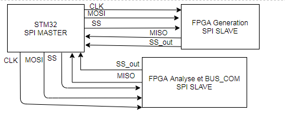
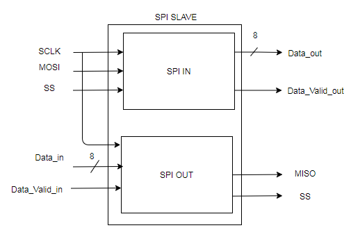

# Communication entre FPGA et uC

## Librarie STM32 (SPI MASTER)

La librairie est encore en developpement.
La librairie se trouve dans le dossier "driver"
Environnement de developpement : CubeMX et CubeIDE (vous pouvez utiliser votre IDE préférer)
Sur cubeMX, après choix du bus spi, configurer le comme suite
CPOL = 0
CPHA = 1

Entrées | PIN  | Description
--------|------|-------------
SCLK    |      | SCLK(SPI)
MISO    |      | MOSI(SPI)
MOSI    |      | MISO(SPI)
CS      |      | SS (SPI) GPIO : output
CS_IN   |      | active when receiving signal from FPGA4S pin (CS_OUT) GPIO : intput

Note : carte utilisée pour le test NUCLEO-L152RE

## Librairie FPGA (SPI SLAVE)

Les components se trouvent dans le dossier "Components FPGA SPI".

Entrées        | PIN  | Description
---------------|------|-------------
SCLK           |      | SCLK(SPI)
MISO           |      | MOSI(SPI)
MOSI           |      | MISO(SPI)
CS             |      | SS (SPI) GPIO : output
CS_OUT         |      | active when sending to the master
Data_in        |      | byte to send to master
Data_valid_in  |      | active when the byte in input Data_in is complete and ready to send
Data_valid_out |      | active when the byte has been receive by MOSI
Data_out       |      | byte receive by MOSI
SS_out         |      | active when sending to the master

